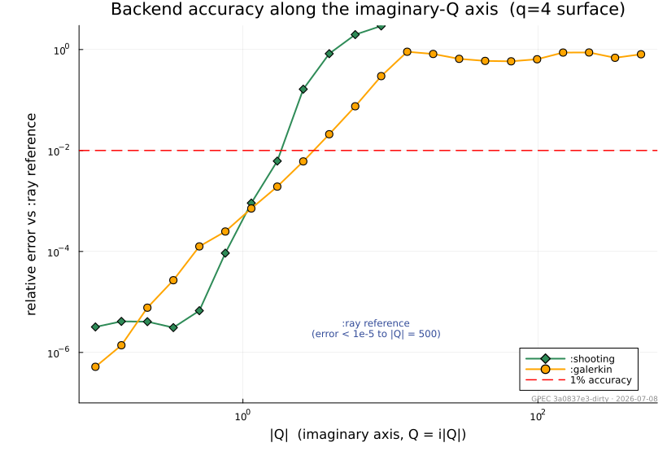
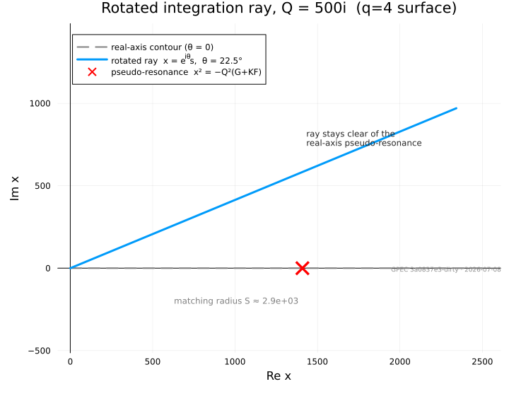
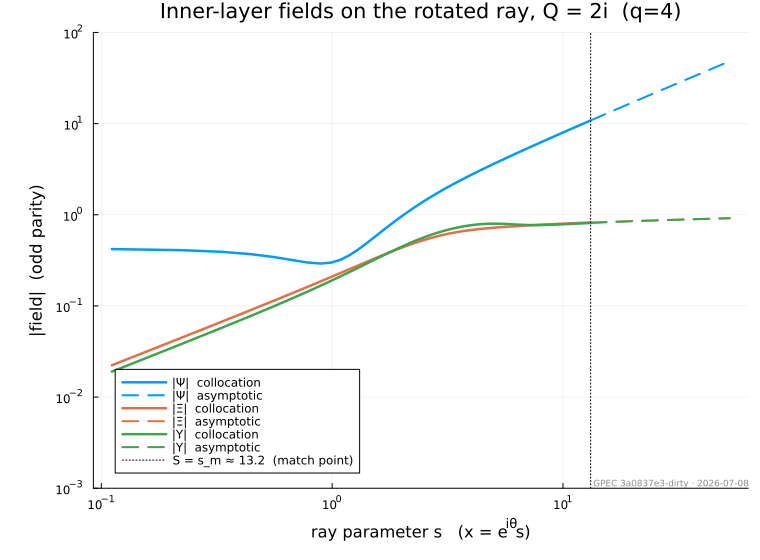

# Tearing Module

The `Tearing` module groups the resistive tearing-mode analysis stack:
`InnerLayer` (per-surface inner-layer matching data Δ(Q) for the GGJ and
SLAYER models), `Dispersion` (physics-agnostic complex-plane scan and
contour-intersection root extraction), and `Runner` (user-facing TOML
configuration, profile loading, and HDF5 output).

## Layer Inputs

Equilibrium/ForceFreeStates glue that assembles per-surface inner-layer inputs.

```@autodocs
Modules = [GeneralizedPerturbedEquilibrium.Tearing]
```

The module provides an abstract [`InnerLayerModel`](@ref InnerLayer.InnerLayerModel) interface and two
concrete models: the **GGJ (Glasser–Greene–Johnson)** layer documented below, with three
interchangeable solver backends, and the pressureless **SLAYER** Fitzpatrick Riccati layer.
Further inner-layer models (kinetic layers) plug in through the same interface.

Two source papers define the equations and the asymptotic construction, and are
cited by their equation numbers throughout the code and below:

- **GWP2016** — A. H. Glasser, Z. R. Wang and J.-K. Park, *Computation of
  resistive instabilities by matched asymptotic expansions*, Phys. Plasmas
  **23**, 112506 (2016).
- **GW2020** — A. H. Glasser and Z. R. Wang, *Asymptotic solutions and
  convergence studies of the resistive inner region equations*, Phys. Plasmas
  **27**, 012506 (2020).

## Governing equations

At a rational surface the layer equations couple three fields — the perturbed
flux ``\Psi`` and two auxiliary layer variables ``\Xi`` and ``\Upsilon`` — as
functions of the scaled distance ``x`` from the surface. In the GWP2016 form
(Eq. 11 ≡ GW2020 Eq. 1) they are

```math
\begin{aligned}
\Psi''    &= H\,\Upsilon' + Q\,(\Psi - x\,\Xi),\\[2pt]
\Xi''     &= \frac{1}{Q^{2}}\Big[\,Q x^{2}\,\Xi - Q x\,\Psi - (E+F)\,\Upsilon - H\,\Psi'\,\Big],\\[2pt]
\Upsilon''&= \frac{1}{Q}\Big[\,x^{2}\,\Upsilon - x\,\Psi - Q^{2}\big(G(\Xi-\Upsilon) - K(E\Xi + F\Upsilon + H\Psi')\big)\Big],
\end{aligned}
```

where ``E, F, G, H, K`` are the flux-surface-averaged equilibrium coefficients
of GWP2016 Eq. (A8) and ``Q`` is the dimensionless growth rate defined below.
These coefficients are collected in [`GGJParameters`](@ref InnerLayer.GGJParameters).

### Dimensionless scales

The layer is scaled by the local Lundquist number ``S = \tau_R/\tau_A`` (ratio
of resistive to Alfvén time). The displacement and growth-rate scales are

```math
X_0 = S^{-1/3}, \qquad Q_0 = X_0/\tau_A \qquad \text{(GWP2016 Eqs. A14–A15)},
```

so a physical growth rate ``\gamma`` maps to the scaled eigenvalue
``Q = \gamma/Q_0`` ([`inner_Q`](@ref InnerLayer.inner_Q)) that appears in the equations above, and
the scaled matching data are returned to physical units by the
``X_0^{-2\sqrt{-D_I}} = S^{\,2\sqrt{-D_I}/3}`` rescaling (together with the
``v_1^{\,2\sqrt{-D_I}}`` linear-scale factor; [`rescale_delta`](@ref InnerLayer.rescale_delta)).

### Mercier index and matching exponents

The premise of an inner-layer model is local Mercier stability. The Mercier
interchange index and its resistive counterpart are

```math
D_I = E + F + H - \tfrac14, \qquad
D_R = E + F + H^2 = D_I + \big(H-\tfrac12\big)^2 \qquad \text{(GWP2016 A9–A10)},
```

([`mercier_di`](@ref InnerLayer.mercier_di), [`mercier_dr`](@ref InnerLayer.mercier_dr)). For ``D_I < 0`` the large-``x``
solutions are the two power laws ``x^{r_\pm}`` with the Frobenius exponents

```math
r_\pm = \tfrac32 \pm \sqrt{-D_I}, \qquad p_1 \equiv \sqrt{-D_I}
\qquad \text{(GW2020 Eq. 49)}.
```

The matching datum ``\Delta`` is the amplitude of the large solution
``x^{r_+}`` when the small solution ``x^{r_-}`` is normalized to unity (i.e. the
ratio of large to small coefficient), in the physical (outer-matching)
normalization. Imposing the two parities at ``x=0`` (odd:
``\Psi'(0)=\Xi(0)=\Upsilon(0)=0``; even: ``\Psi(0)=\Xi'(0)=\Upsilon'(0)=0``)
gives the pair ``(\Delta_\mathrm{odd}, \Delta_\mathrm{even})`` of GWP2016
Eqs. (34)–(35).

## Numerical method

!!! note "Benchmark surface used in the figures"
    Every figure on this page is computed on the ``q = 4`` rational-surface
    benchmark ([`q4_surface_benchmark`](@ref InnerLayer.q4_surface_benchmark)) —
    a fixed set of GGJ layer coefficients (``S = \tau_R/\tau_A \approx 4.6\times10^{6}``,
    ``D_I \approx -0.31``) frozen into code from the ``q = 4`` rational surface of
    the DIII-D-like (TkMkr H-mode) equilibrium of the `resistive_resmets`
    benchmark, at that case's per-surface ``\eta`` and ``\rho``. The well-conditioned
    real-``Q`` cross-check in the Validation section instead uses the
    Glasser & Wang (2020) Eq. (55) surface.

### Solver backends

The `GGJ` model exposes three solvers through the `solver` type parameter of
[`GGJModel`](@ref InnerLayer.GGJModel); all consume the same large-``x`` asymptotic basis and return
``\Delta`` in the same convention:

| backend | method | robust regime |
|:--------|:-------|:--------------|
| `:shooting` | backward stable shoot from ``X_\mathrm{max}\to 0`` | ``\lvert Q\rvert \ll 1`` |
| `:galerkin` | Hermite-cubic finite-element (real axis) | drift onset ``\lvert Q\rvert \sim 1``; 1% error by ``\lvert Q\rvert \sim 4`` |
| `:ray` (default) | rotated-contour spectral-element collocation | ``\lvert Q\rvert \sim 500`` on/near the imaginary axis |

The difficulty is the large-``|Q|`` imaginary-``Q`` axis itself, where rotation
and resistivity scans live: there the layer's pseudo-resonance at
``x^2 = -Q^2(G+KF)`` sits directly on the real-``x`` integration path and the
exponential dichotomy weakens, so both older backends degrade — `:shooting`
through the dichotomy of the backward shoot, `:galerkin` through real-axis
oscillation and the on-axis pseudo-resonance. (The poles of ``\Delta(Q)``
itself lie on and near the **real**-``Q`` axis — they are the layer
eigenvalues; ``\Delta`` is smooth along the imaginary axis.) Measured against
the `:ray` reference along the imaginary axis, `:shooting` holds to
``|Q|\sim 1`` and `:galerkin` to ``|Q|\sim 4`` (the 1% error crossings)
before both lose all accuracy:



The `:ray` backend was written to reach the large-``|Q|`` imaginary-axis regime
(rotation and resistivity scans) where these fail. The remainder of this section
describes it.

### Entire-solution formulation

`:ray` works with the **plain** state ``v = (\Psi, \Xi, \Upsilon, \Psi',
\Xi', \Upsilon')`` and writes the layer equations as the first-order system

```math
\frac{dv}{dx} = M(x)\,v .
```

The coefficient matrix (the `GGJ` internal `ode_matrix`) is **polynomial** in ``x``, so
``x = 0`` is an ordinary point — the ``x^{-2}/x^{-4}`` singularities of the
GW2020 Eq. (2) scaled form ``(x\Psi,\ \Psi'/x,\ \dots)`` are artifacts of that
scaling, not of the equations. Because the coefficients are entire, the system
continues analytically to complex ``x``, which is what makes the contour
rotation below legitimate.

### The rotated ray

The equations are continued onto the ray

```math
x = e^{i\theta}\, s, \qquad s \in [0, S], \qquad \theta = \tfrac14\arg Q,
```

The angle ``\theta = \tfrac14\arg Q`` makes the parabolic-cylinder exponent of
the outer solutions exactly real and clears the pseudo-resonance at
``x^2 = -Q^2(G + K F)``, which on the imaginary-``Q`` axis is real and large and
therefore sits directly on the un-rotated (real-``x``) contour. Rotating the
contour lifts it off that point; ``\theta = 0`` recovers a real-axis solve.



### Spectral-element collocation BVP

On ``[0, s_m]`` the system is discretized by a **global Chebyshev
spectral-element collocation** boundary-value problem: right-biased (Radau-like)
collocation at the Chebyshev–Lobatto nodes of each cell, three parity conditions
at the ordinary-point origin ``s = 0``, and six matching conditions at the outer
edge,

```math
v(S) - \Delta\, U_b - c_1 E_1 - c_2 E_2 = U_s ,
```

with the matching datum ``\Delta`` and the two decaying-mode amplitudes
``c_1, c_2`` carried as **bordered unknowns**. Here ``U_s, U_b`` are the small
and large power-like solutions and ``E_{1,2}`` the forward-decaying exponential
pair. No quantity is ever propagated across the layer, so the exponential
dichotomy that limits the shooting backend never enters; the boundary condition
splits it exactly.

The two parities differ only in their three ``s=0`` rows, i.e. by a rank-3
update, so both are obtained from a **single sparse LU factorization** plus a
Woodbury correction (the `GGJ` internal `_solve_parities`) rather than two
factorizations. A residual-driven bisection refinement adds cells until the
collocation residual meets tolerance, with a roundoff-plateau guard.

### Far-field boundary and the inward march

The large-``x`` boundary data use the **same** `inps` Wasow asymptotic basis as
the other backends (GW2020 Eqs. 3–52), evaluated at complex ``x`` by
`RayAsymptotics.jl` and applied at the series radius ``S`` where the series is
trusted (residual below tolerance; [`pick_smax`](@ref InnerLayer.pick_smax)). For large ``|Q|`` the
trusted radius ``S`` can be far outside the collocation domain ``s_m``, so the
power-pair data are transported inward from ``S`` to ``s_m`` by an **L-stable
2-stage Radau IIA march** in the quotient modulo the decaying exponential pair —
the subspace in which ``\Delta`` is defined (the `GGJ` internal
`march_boundary`). An L-stable implicit method is essential: the decaying pair
grows under backward integration, so any explicit marcher is stability-limited
to ``O(\rho S^2)`` steps, while the Radau march *damps* the unresolvable
backward-growing directions instead of amplifying them.

The damped-zone march runs in `Complex{Double64}` extended precision. At large
``S`` the near-parallel power-pair geometry amplifies the structured backward
error of the ill-conditioned implicit solves into ``\Delta``-mixing of order
``10^{-4}`` at ``|Q| = 500`` in `Float64`; extended precision removes this
floor, while the well-conditioned resolved band stays in `Float64`.

The result is a seamless numeric↔asymptotic solution: the collocation solution
on ``[0, s_m]`` and the analytic ``u_\mathrm{small} + \Delta\,u_\mathrm{big}``
representation for ``s \ge S`` share the same power-law tail — the overlap the
outer-region matching relies on.



## Validation and benchmarks

**Cross-check against the Fortran `rmatch` solver.** At the Glasser & Wang
(2020) Eq. (55) operating point ``Q = 0.1234`` (real) the `:galerkin` backend
reproduces the Fortran `rmatch deltac` solver to ``\sim 10^{-8}``:

| quantity | `:galerkin` (= Fortran to ``10^{-8}``) | `:ray` |
|:---------|:---------------------------------------|:-------|
| ``\Delta_\mathrm{odd}`` | ``3.698368\times 10^{4}`` | ``3.69789\times 10^{4}`` |
| ``\Delta_\mathrm{even}`` | ``14.759721`` | ``14.759715`` |

The large ``\lvert\Delta_\mathrm{odd}\rvert \sim 4\times10^{4}`` means this
operating point sits near a pole of ``\Delta(Q)``, where every solver's error
is amplified by the pole geometry; the ``1.3\times10^{-4}``
`:galerkin`↔`:ray` difference in ``\Delta_\mathrm{odd}`` (versus
``4\times10^{-7}`` in ``\Delta_\mathrm{even}``) is consistent with that
amplification, not a defect of either backend.

**Physical benchmark on the imaginary axis.** On the ``q=4`` rational-surface
benchmark ([`q4_surface_benchmark`](@ref InnerLayer.q4_surface_benchmark), ``S \approx 4.58\times10^6``,
``D_I \approx -0.312``) the `:ray` backend is pinned at ``Q = 500i``, a regime
entirely beyond `:galerkin`:

| quantity | value at ``Q = 500i`` |
|:---------|:----------------------|
| ``\Delta_\mathrm{odd}`` | ``2.4720 + 13.3540\,i`` |
| ``\Delta_\mathrm{even}`` | ``0.13750 + 0.74275\,i`` |

**Convergence and contour invariance.** Because ``\Delta`` is an analytic
invariant of the contour angle, re-solving with each numerical knob perturbed on
an independent axis ([`delta_convergence`](@ref InnerLayer.delta_convergence)) gives an honest error bar: at
``Q = 500i`` the worst-case spread across all knobs is ``\sim 5\times10^{-6}``
for ``\Delta_\mathrm{odd}`` and ``\sim 6\times10^{-7}`` for
``\Delta_\mathrm{even}``. That is a single-machine error bar: across
machines/BLAS builds the absolute values reproduce to ``\sim 10^{-5}``
relative (the damped-zone implicit solves carry platform-dependent structured
roundoff), which is why the table above quotes five significant figures.


## Choosing a backend

`:ray` is the **default** — `GGJModel()` constructs `GGJModel{:ray}()`. It is
the correct choice for ``|Q| \gtrsim 1`` and for any ``Q`` near the imaginary
axis. `:galerkin` remains available and may be faster for very small real
``|Q|``, but note the backends take disjoint numerical-knob keywords: pass
`GGJModel(solver=:galerkin)` explicitly when supplying the Galerkin `nx`/`xfac`
knobs — passing them to the default `:ray` backend throws a `MethodError`.

```julia
using GeneralizedPerturbedEquilibrium.InnerLayer

p = q4_surface_benchmark()          # GGJParameters for the q=4 benchmark surface
γ = 500im * GGJ.q0(p)               # physical rate placing Q on the imaginary axis at 500i

Δ = solve_inner(GGJModel(), p, γ)   # (Δ_odd, Δ_even) with the default :ray backend

# Full result (raw Δ, contour, mesh, nodal solution, residuals) via solve_ray:
res = solve_ray(p, GGJ.inner_Q(p, γ))
res.Δ, res.resid, res.bc_cond
```

## API Reference

### InnerLayer

```@autodocs
Modules = [GeneralizedPerturbedEquilibrium.InnerLayer]
```

### GGJ

```@autodocs
Modules = [GeneralizedPerturbedEquilibrium.InnerLayer.GGJ]
```

## SLAYER

```@autodocs
Modules = [GeneralizedPerturbedEquilibrium.InnerLayer.SLAYER]
```

## Dispersion

```@autodocs
Modules = [GeneralizedPerturbedEquilibrium.Dispersion]
```

## Runner

```@autodocs
Modules = [GeneralizedPerturbedEquilibrium.Runner]
```
