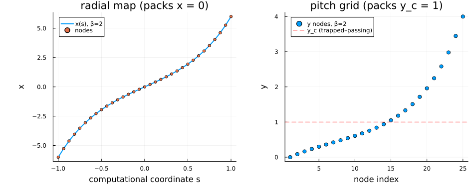
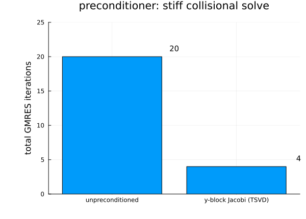
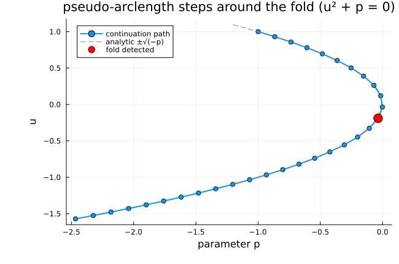
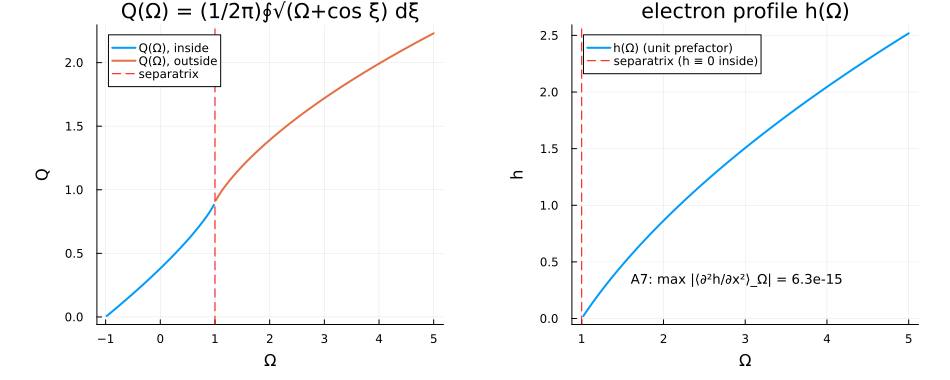
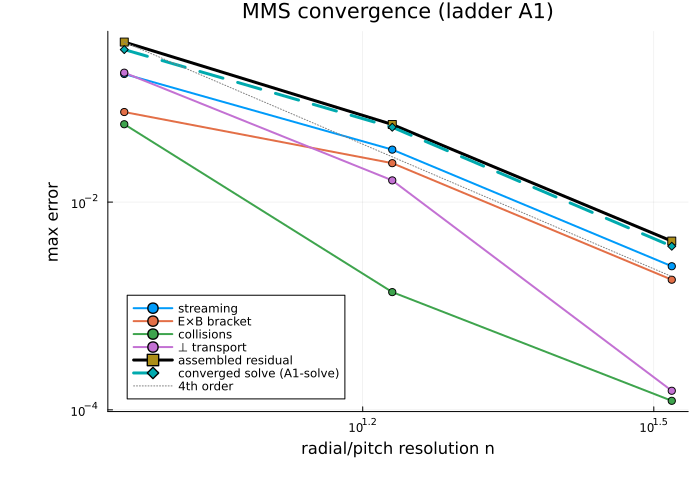

# Islands — numerics as implemented (M1–M2)

This chapter documents the Islands machinery **as it exists in the code today**
— the discretization, operator stack, solver, and output-moment assembly landed
by milestones M1 and M2, with the verification evidence behind each piece. It
is the "Physics Book" companion to the aspirational [design documents](design/00-roadmap.md):
the design docs say what Islands *will* compute; this page says what is
*implemented and verified now*, equation by equation.

!!! warning "Where the physics is (and isn't)"
    Everything on this page is **structure and numerics**. Under the module's
    `[VERIFY]` policy (`src/Islands/CLAUDE.md`), no physics coefficient, sign,
    or normalization from the drift-kinetic literature has been assigned a
    value anywhere in `src/`: every such quantity enters as a *supplied,
    gated parameter* (many deliberately default to `NaN` so an un-cleared
    convention poisons results rather than guessing). The human clearance
    queue that un-gates the physics is `QUESTIONS.md` entries **Q2–Q4**; until
    then the physics benchmarks (`benchmarks/islands/`) ship skipped by design.

## 1. Phase space and discretization

The Level-0 solve lives on the orbit-averaged phase space
``(x, \xi;\, y, E, \sigma)`` — radial distance from the rational surface,
helical angle, pitch ``y = \lambda B_{\max}``, energy, and the parallel-velocity
sign ``\sigma = \pm 1`` (design `03 §1`). Implemented in `Islands.PhaseSpace`:

**Helical angle ``\xi``** — Fourier pseudo-spectral on the periodic domain. The
dense spectral derivative on an even number ``n`` of uniform nodes is

```math
(D_1)_{jk} \;=\; \frac{(-1)^{j-k}}{2}\,\cot\!\Big(\frac{(j-k)\,h}{2}\Big),
\qquad j \neq k,\quad h = \tfrac{2\pi}{n},
```

exact for bandlimited data (verified to ``6\times10^{-15}`` in the tests).

**Radial ``x`` and pitch ``y``** — high-order finite differences on
layer-clustered grids. A uniform computational coordinate ``s \in [-1, 1]`` maps
to the physical coordinate through a monotone ``\sinh`` stretching that packs
nodes at the internal layers the drift-kinetic problem develops (`04 §1–2`):

```math
x(s) \;=\; x_c + L\,\frac{\sinh(\beta s)}{\sinh(\beta)}
\qquad\Longrightarrow\qquad
\frac{d}{dx} = \frac{1}{x'(s)}\frac{d}{ds},\quad
\frac{d^2}{dx^2} = \frac{1}{x'(s)^2}\frac{d^2}{ds^2} - \frac{x''(s)}{x'(s)^3}\frac{d}{ds}.
```

The radial grid packs toward the rational surface ``x = 0``; the pitch grid
toward the trapped–passing boundary ``y_c`` — the two layers whose widths scale
as ``\nu^{1/2}`` and set the prior art's operating floor (`04 §2`).
Derivative matrices use Fornberg weights on windows of ``\mathrm{order}+d``
points for the ``d``-th derivative, so ``D_1`` **and** ``D_2`` hold the design
order uniformly, including at boundary rows. Composite-Simpson weights on the
same nodes (pushed through the map Jacobian) give quadrature at matching order.

**Energy ``E``** — Gauss–Laguerre nodes and weights: the Level-0 Maxwellian
weight ``\int_0^\infty f(E)\, e^{-E}\, dE = \sum_i w_i f(E_i)`` (a slowing-down
background at Level 2 changes the map, not the machinery).



**Island-resolution adequacy.** The Δ output moments (§7) are dominated by the
current response at the **separatrix** ``x \sim w``, not at the ``x = 0`` node, so
a grid that under-resolves the island half-width ``w`` gives ``L_x``- and
clustering-sensitive garbage (a coarse grid put the whole moment on a single
node). The adequacy condition is ``\Delta x(0) \le w/K`` — ``K`` radial nodes
across the island half-width (``K \approx 5``–``10``) — **with** a far field that
is truly far, ``L_x/w \gtrsim 5``. `island_clustering_x` inverts the exact
``\sinh``-map central spacing ``\Delta x(0) = L_x\,\sinh(\beta\Delta s)/\sinh\beta``
for the clustering ``\beta`` that meets ``\Delta x(0) \le w/K`` on a given node
budget (refusing to over-cluster and starve the far field); `resolved_island_grid`
assembles such a grid and `is_island_resolved` reports the two adequacy numbers.
Every Δ-output benchmark runs at ``\ge 2`` resolutions and reports convergence —
no pass on a single grid (docs/05).

*Implementing symbols:* `PhaseSpace.FourierGrid`, `PhaseSpace.MappedFDGrid`,
`PhaseSpace.GaussGrid`, `PhaseSpace.IslandGrid`, `PhaseSpace.fd_weights`,
`PhaseSpace.island_clustering_x`, `PhaseSpace.resolved_island_grid`,
`PhaseSpace.is_island_resolved`, `PhaseSpace.central_x_spacing`.

## 2. The operator stack

The unknowns are ``U = (g,\, \tilde\Phi)`` — the orbit-averaged distribution
``g(x, \xi, y, E, \sigma)`` per species and the electrostatic potential
``\tilde\Phi(x, \xi)`` — and the steady-state residual is assembled as a sum of
independent operator applications (design `03 §2`; no term inspects which
others are active, no regime branches anywhere):

```math
R_g(U) \;=\; \sum_{\text{terms } T} T[U],
\qquad
R_\Phi(U) \;=\; M[g] - \alpha\,\tilde\Phi + S_\Phi ,
```

with the Level-0 term structures (each coefficient below is **supplied data**,
its physics value gated):

| Term | Structure | Gated coefficient |
|---|---|---|
| `ParallelStreaming` | ``a_\xi\, \partial_\xi g + a_x\, \partial_x g`` | **cleared** — ``(\hat L_q^{-1}\hat w^2/4\hat\rho_{\theta i})\Theta\,\{\Omega,\cdot\}`` advection along island surfaces (§8) |
| `MagneticDrift` | ``c_D\, \partial_\xi g`` (with the `:original`/`:improved` ``\hat L_B^{-1}`` toggle) | the precession frequency ``\hat\omega_D(y, E; \sigma)`` |
| `ExBDrift` | ``c_E \left( \partial_\xi\tilde\Phi\, \partial_x g - \partial_x\tilde\Phi\, \partial_\xi g \right)`` — the ``(x,\xi)`` Poisson bracket, the one state-nonlinear Level-0 term | **cleared** — ``c_E=\tfrac12\langle 1/\hat v_\parallel\rangle_\theta`` (passing σ-odd ``(\sigma/2\sqrt E)B_1(y)``, trapped ≡ 0; §8) |
| `PitchAngleDiffusion` | ``c\,(K g)`` along ``y`` (mimetic form, §3) | **cleared** — orbit-averaged collision D+E: σ-odd ``c\propto\hat\nu_{ii}/(m\hat\rho_{\theta i}\sigma\hat v)``, ``K=\partial_y(y\langle\sqrt{1-yb}\rangle_\theta\,\partial_y)``, flat measure (§8) |
| `CollisionalDrag` | ``a_x\,\partial_x g`` | **cleared** — collision A: ``+\hat\nu_{ii}/m``, passing-only, σ-even (§8) |
| `NeoclassicalDiffusion` | ``c\,\partial_x^2 g`` | **cleared** — collision B (cross-``p_\phi`` transport): σ-odd ``+\tfrac{\hat\nu_{ii}\sigma\hat v\,\hat\rho_{\theta i}}{2m(1+\varepsilon)}y\langle 1/\sqrt{1-yb}\rangle_\theta`` (§8) |
| `CollisionalCross` | ``c\,\partial_{xy}^2 g`` | **cleared** — collision C: ``+2\hat\nu_{ii}y/m``, passing-only, σ-even (§8) |
| `MomentumRestoring` | ``r(E)\,\bar U(x,\xi)`` — the one **nonlocal** term (a velocity moment redistributed) | **cleared** — collision F: ``\bar U=\tfrac{1}{\sqrt\pi\langle\hat\nu_{ii}\rangle_u}\{\hat\nu_{ii}\hat v_\parallel g\}_v``, ``r=2\hat\nu_{ii}(1+\varepsilon)/(m\hat\rho_{\theta i})`` (§8) |
| `GradientDrive` | additive source | the ``(\mathbf v_E + \mathbf v_D + \mathbf v_{\tilde\psi})\cdot\nabla F_0`` drive |
| `Quasineutrality` | ``M[g] - \alpha\tilde\Phi + S_\Phi`` | **cleared** — ``\alpha=(\tau+1)/\tau`` and the drive ``S_\Phi=\hat L_{n0}^{-1}(x-\hat h)`` (§8) |

Every `apply!` kernel is allocation-free (a CI regression test holds this at
**0 bytes**) and generic over the element type, so ForwardDiff dual numbers
flow through the entire stack — that is what makes the solver's Jacobian exact
(§5).

Implemented by: `Operators.ParallelStreaming`, `Operators.MagneticDrift`,
`Operators.ExBDrift`, `Operators.Collisions`, `Operators.PitchAngleDiffusion`,
`Operators.CollisionalDrag`, `Operators.NeoclassicalDiffusion`,
`Operators.CollisionalCross`, `Operators.MomentumRestoring`,
`Operators.GradientDrive`, `Operators.PerpTransport`,
`Operators.RadiationSink`, `Operators.Quasineutrality`.

The last two are Level-4 closure stubs, and `Collisions` is the non-mimetic
collision slot superseded at Level 0 by `PitchAngleDiffusion` (§3); the stack is
assembled by `Operators.residual!` over an `Operators.IslandStack`. The
anchor-sync check `Verify.check_anchor_sync` holds this list in step with the
`AbstractTerm` subtypes so a new operator without documentation, or a doc naming
a deleted symbol, fails the check.

## 3. The conservative collision structure

Bootstrap physics is unforgiving about non-conservative collision operators
(design `00`, risk register), so the pitch-angle operator is implemented in
**mimetic divergence form**. With gradient matrix ``G`` (the ``y``-grid ``D_1``),
quadrature weights ``w_q``, a supplied non-negative diffusivity profile ``P(y)``
and measure ``w(y)``:

```math
K \;=\; -\,W_q^{-1}\, G^{\mathsf T}\, \mathrm{diag}(P \circ w_q)\, G,
\qquad W_q = \mathrm{diag}(w \circ w_q),
```

which enjoys the two Level-0 conservation properties **exactly in floating
point**, not just asymptotically:

```math
\mathbf 1^{\mathsf T} W_q K g
  = -\,(G\mathbf 1)^{\mathsf T}\,\mathrm{diag}(P \circ w_q)\,(G g) = 0
\quad\text{(particles; } G\mathbf 1 = 0\text{)},
```
```math
g^{\mathsf T} W_q K g
  = -\,(G g)^{\mathsf T}\,\mathrm{diag}(P \circ w_q)\,(G g) \;\le\; 0
\quad\text{(entropy sign)}.
```

Verified to ``10^{-14}`` (ladder **A4**). A physically-profiled ``P`` vanishes
at the pitch-domain endpoints, so zero-flux boundary behavior is built into the
operator — no artificial ``y`` boundary conditions. (This mattered in practice:
the generic ``a_y \partial_y^2`` form *without* boundary conditions is an
unstable BVP discretization under refinement; the mimetic degenerate form is
the correct structure.)

*Implementing symbols:* `Operators.conservative_pitch_operator`,
`Operators.PitchAngleDiffusion`.

## 4. Boundary conditions

Far-field rows at ``|x| = L_x`` are replaced by matching conditions
``g - g_\infty`` and ``\tilde\Phi - \tilde\Phi_\infty`` (Dirichlet-type against
supplied far-field states). **Never bare Neumann** ``\partial_x g = 0``: the
prior art traced a spurious "winged" solution branch directly to Neumann
non-uniqueness (`01 §3`). The physical far field — the no-island neoclassical
solution — is gated physics, so the code takes it as supplied data; the tests
use manufactured far fields. These conditions are also what make the
first-order-in-``x`` advective solve well-posed.

*Implementing symbols:* `Operators.FarFieldConditions`, `Operators.apply_farfield!`.

## 5. The Newton–Krylov solve

Decision D2: steady-state Newton–Krylov, never time-stepping and never the
sources' nested Picard loops (which, per the prior-art forensics, *never met*
their own convergence criterion in production). The pieces (design `04 §5`):

**Exact matrix-free Jacobian.** The directional derivative comes from one dual-
number sweep of the residual — no finite-difference Jacobian, no global sparse
matrix:

```math
J(u)\,v \;=\; \left.\frac{d}{d\varepsilon}\right|_{\varepsilon=0} F(u + \varepsilon v)
\quad\text{via ForwardDiff duals through the stack.}
```

**Inexact Newton with Eisenstat–Walker forcing.** Each step solves
``J\,\delta u = -F`` by GMRES only to the tolerance the outer iteration needs,

```math
\eta_k = \gamma \left( \frac{\lVert F_k \rVert}{\lVert F_{k-1} \rVert} \right)^{2},
```

with a backtracking line search on ``\lVert F \rVert``. Convergence is declared
on the norm **and** the pointwise maximum of the residual — the array-averaged
residual famously hid locally divergent regions in the prior art.

**Physics-block preconditioning with explicit regularization.** The stiff
pitch-direction blocks are factored per pencil by SVD and truncated below
``\epsilon\,\sigma_{\max}`` — the deliberate treatment of the intrinsically
near-singular trapped–passing matching block (`04 §3`; the prior art measured
``\mathrm{rcond} \sim 10^{-16}`` there and got machine-dependent *noise, not
crashes*, under plain LU). On a collision-dominated test solve the block-Jacobi
preconditioner cuts the work by an order of magnitude:



A companion diagnostic tracks the smallest singular value of the ``y_c``-block
of the (tiny-grid, debug) dense Jacobian — ladder **A8** — so a silent
conditioning regression is *tested for*, not observed.

**The ``(x, \xi)`` advection-plane preconditioner (physical ``\hat\rho_{\theta i}``).**
At physical parameters the Jacobian is severely ill-conditioned —
``\mathrm{cond}(J)\sim 10^{9}``, growing as ``1/\hat\rho_{\theta i}`` through the
``1/\hat\rho_{\theta i}`` streaming and collision coefficients — and unpreconditioned
GMRES stalls. The ill-conditioning is a **cross-pencil advection** effect, not the
``y_c`` collision block, so the ``y``-pencil `YBlockJacobi` is the wrong tool (it
makes it *worse*). Inverting instead the exact ``(x,\xi)`` **plane block** per
``(y, E, \sigma)`` drops the preconditioned condition number by ``\sim`` four orders
of magnitude (``\mathrm{cond}(M^{-1}J)\sim 10^{5}``), which is what lets matrix-free
Newton–Krylov converge at physical ``\hat\rho_{\theta i}``, matching `newton_direct`.

The plane blocks are built **matrix-free** by a *y-colored JVP*: each
``(iy, iE, i\sigma)`` pencil owns a contiguous ``n_x n_\xi`` slice of the flattened
``g`` (the `flatten!` layout), and — once the one **nonlocal** term (the
momentum-restoring ``\bar U``, which couples every plane densely) is dropped — the
reduced Jacobian couples planes *only* through the pitch/cross collision operators,
which are **banded in ``y``** (the mimetic ``K = G^{\mathsf T} D G`` inherits a
half-bandwidth ``\le \mathrm{order}`` from the ``y``-grid ``D_1``) and act only within
a fixed ``(E, \sigma)``. Planes whose ``iy`` are spaced beyond the band never
cross-couple, so they are seeded **together** by color: for each in-plane node and
each ``y``-color, one Jacobian–vector product recovers that column of every
same-color plane block at once — ``n_x n_\xi\,(2\,\mathrm{order}+1)`` products,
independent of ``n_y n_E n_\sigma``. Each block is TSVD-regularized exactly like the
``y``-pencil blocks; the ``\Phi`` rows carry the diagonal ``-\alpha`` (the
quasineutrality shielding coefficient). The nonlocal term is dropped only *inside the
preconditioner* — the solved residual is the full stack — and preconditioner
approximations are the one place `src/Islands/CLAUDE.md` sanctions such regime
knowledge.

*Implementing symbols:* `Solvers.newton_krylov`, `Solvers.JVPOperator`,
`Solvers.YBlockJacobi`, `Solvers.PlaneJacobi`, `Solvers.plane_blocks`,
`Solvers.without_momentum_restoring`, `Solvers.dense_jacobian`,
`Verify.yc_block_sigma_min`.

## 6. Continuation and fold detection

**Natural-parameter continuation (the ``w``-sweep globalization).** At physical
parameters the cold Newton solve reaches only modest island widths — beyond a
point Newton from a zero initial guess leaves the basin and the line search
stalls. `natural_continuation` walks the width ``w`` up an increasing schedule,
**warm-starting every solve from the last converged state** and controlling the
step adaptively (halve on a failed or singular solve, grow on success, capped by
the distance to the next requested ``w``), so each step starts inside the basin.
It rebuilds the operator stack only once per accepted step — never per residual
evaluation — and treats a solve that throws (a singular linearization from too
large a step) as a non-convergence that triggers a halving. This is the
globalization that makes the large-``w`` B2 sweep reachable; it is deliberately
simpler than the pseudo-arclength scaffold (no tangent, no fold handling) because
the monotone ``w``-sweep has no folds.

**Pseudo-arclength continuation and fold detection.** Δ-surface generation and
(at Level 3) the penetration bifurcation ride on pseudo-arclength continuation,
so fold handling is in from day one. The corrector solves the extended system

```math
G(z) = \begin{pmatrix} F(u, p) \\ t \cdot (z - z_{\text{pred}}) \end{pmatrix} = 0,
\qquad z = (u, p),
```

with a secant tangent ``t`` and fold detection via sign reversal of the
tangent's parameter component ``t_p``:



*Implementing symbols:* `Solvers.natural_continuation`, `Solvers.pseudo_arclength`.

## 7. Island geometry, the electron-closure functions, and the Δ moments

The island flux-surface label is the pinned module convention (half-width
``w``):

```math
\Omega(x, \xi) = \frac{2x^2}{w^2} - \cos\xi,
\qquad \Omega = -1 \text{ at the O-point},\quad \Omega = +1 \text{ at the separatrix},
```

with the flux-surface average
``\langle f \rangle_\Omega = \oint f\,(\Omega + \cos\xi)^{-1/2} d\xi \,/\,
\oint (\Omega + \cos\xi)^{-1/2} d\xi`` — a *diagnostic* only, never a solve
coordinate (Decision D1). The flattened-electron closure geometry is
implemented as structure with a supplied amplitude:

```math
Q(\Omega) = \frac{1}{2\pi} \oint \sqrt{\Omega + \cos\xi}\; d\xi,
\qquad
h(\Omega) = \Theta(\Omega - 1)\; C \int_1^{\Omega} \frac{d\Omega'}{Q(\Omega')},
```

so ``h`` is exactly flat inside the separatrix. Because ``h'(\Omega) = C/Q``,
the chain rule gives the **coefficient-free consistency identity** (ladder
**A7** — the unit target that historically caught inherited bugs in this
lineage):

```math
\Big\langle \frac{\partial^2 h}{\partial x^2} \Big\rangle_{\!\Omega}
 = \frac{4}{w^2}\left[ h''(\Omega)\, \frac{Q}{Q'} \; +\; h'(\Omega) \right]
 \;\equiv\; 0 ,
```

verified to ``10^{-16}`` for arbitrary amplitude ``C``:



The output moments are the two Ampère projections of the species-summed
parallel current ``\bar J_\parallel = \sum_j Z_j \int W_j\, g_j`` (`01 §4`):

```math
\Delta_{\rm neo} \equiv \Delta_{\cos} = C_{\cos} \int dx \oint d\xi\; \bar J_\parallel \cos\xi,
\qquad
\Delta_{\sin} = C_{\sin} \int dx \oint d\xi\; \bar J_\parallel \sin\xi,
```

where the ``\xi``-projection is spectrally exact on the periodic grid. The
current is assembled with the **cleared** parallel-flow weight
``W = \hat v_\parallel = \sigma\sqrt E\sqrt{1-y b_{\min}}`` and the physical
``\int d^3v`` measure (`Configure.parallel_flow_weight` /
`physical_velocity_weights`, `velocity-moment-measure.md`): the ``\sqrt{1-y b_{\min}}``
of ``W`` cancels the pitch Jacobian, so ``\bar J_\parallel`` is regular. The
prefactors ``C_{\cos}=-\mu_0R/2\tilde\psi``, ``C_{\sin}=+\mu_0R/2\tilde\psi`` are
**cleared** (`delta_moment_prefactors`, §8; ``\tilde\psi`` from
`island_flux_amplitude`, the sin normalization the symmetric `[DERIVED]` pin) so
that ``\Delta_{\cos}+i\Delta_{\sin}`` maps onto the linear-layer ``\Delta(Q)``,
and ``\Delta_{\rm neo}`` obeys the stationarity balance ``\Delta' + \Delta_{\rm neo}=0``.
The parity structure ``\Delta_{\cos}`` even / ``\Delta_{\sin}`` odd under
``\xi``-reflection is verified exactly (ladder **A3**).

The growth moment splits (an *approximate diagnostic*, L23 Eq. 2.5.3;
`channel_decomposition`) into the **bootstrap+curvature** channel — the
``\cos\xi`` projection of the flux-surface-constant part
``\bar J_{\rm bs}(x,\xi) = \langle\bar J_\parallel\rangle_{\Omega(x,\xi)}`` — and
the **polarization** residual ``\Delta_{\rm pol} = \Delta_{\rm neo} -
(\Delta_{\rm bs}+\Delta_{\rm cur})``, the piece that flux-surface-averages to
zero. The reconstruction lifts the discrete ``\bar J_\parallel`` to a callable
via a separable local-Lagrange interpolant (`grid_interpolant`) that the
``\langle\cdot\rangle_\Omega`` quadrature samples.

The output assembly `Configure.delta_outputs(grid, phys, species, Usol, cfg)`
turns a converged solve (`Usol`, the bulk-ion ``g``) into
``(\bar J_\parallel, \Delta_{\rm neo}, \Delta_{\sin},`` the decomposition
channels, and the ``\langle\bar J_\parallel\rangle_\Omega`` profile``)`` — the
first physics deliverable of the solved state (the electron/species partition of
`01 §4` is a later diagnostic).

*Implementing symbols:* `Configure.delta_outputs`, `Moments.parallel_current!`,
`Moments.delta_moments`, `Moments.channel_decomposition`,
`Moments.grid_interpolant`, `Moments.omega_average`, `Fields.Q_omega`,
`Fields.h_profile`, `Fields.flat_average_d2h_dx2`.

## 8. The Level-0 configuration assembly (M2c)

`Islands.Configure.configure_level0(grid, phys, species; gated)` assembles a
Level-0 named configuration — the `IslandStack` + far-field conditions + `Δ`
prefactors the solver consumes — by wiring the **human-cleared** coefficient
builders (§7, the M2b derivation lane) onto the operator stack:

- the magnetic drift `c_D[ix, iξ, iy, iE, iσ]` from `magnetic_drift_frequency`,
  evaluated on the phase-space grid (``\hat v = \sqrt E``, the ``:original`` /
  ``:improved`` toggle, and the forbidden pitch region ``y \ge (1+\varepsilon)/
  (1-\varepsilon)`` zeroed since it carries no particles);
- the **island-streaming** coefficients ``a_\xi``, ``a_x`` from
  `streaming_coefficients` — the passing-particle (`Θ(y_c−y)`) advection along
  island flux surfaces, ``(\hat L_q^{-1}\hat w^2/4\hat\rho_{\theta i})\Theta\,\{\Omega,\cdot\}``
  (`parallel-streaming.md`; normalized to leave `c_D = ω̂_D` unchanged);
- the **``E\times B`` coupling** ``c_E[ix,iξ,iy,iE,iσ]`` from `exb_coupling_table`
  — the velocity-dependent Poisson-bracket coefficient
  ``c_E=\tfrac12\langle 1/\hat v_\parallel\rangle_\theta``, **passing-only**
  (``\Theta(y_c-y)``) and σ-odd, ``c_E=(\sigma/2\sqrt E)B_1(y)`` with the new
  orbit bracket ``B_1(y)=\langle 1/\sqrt{1-yb}\rangle_\theta``
  (`orbit_average_exb_bracket`); trapped ≡ 0 (`exb-coupling.md`; the ``\hat\rho_{\theta i}``
  cancels, so no new physics parameter);
- the **full orbit-averaged collision operator** (`orbit-averaged-collision.md`):
  the σ-odd mimetic **pitch diffusion** D+E — `pitch_diffusivity_profile`
  (``P_{oa}=y\langle\sqrt{1-yb}\rangle_\theta``, flat measure) fed to
  `conservative_pitch_operator`, and the σ-odd coefficient
  `pitch_collision_coefficient` (``\propto\hat\nu_{ii}(1+\varepsilon)/(m\hat\rho_{\theta i}\sigma\hat v)``);
  the `∂_x` **drag** (`collisional_drag_coefficient`), `∂²_x` **neoclassical**
  (`neoclassical_diffusion_coefficient`, using ``\langle 1/\sqrt{1-yb}\rangle_\theta``),
  and `∂²_{xy}` **cross** (`collisional_cross_coefficient`) terms — magnitude
  ``\varepsilon^{3/2}\nu_\star`` (from `Level0Physics.nu_star`), ``1/(m\hat\rho_{\theta i})``
  (from `Level0Physics.m`); the forbidden pitch region (``y\ge 1/b_{\min}``) is
  pinned ``g=0``. The sixth, **nonlocal momentum-restoring** term F
  (`momentum_restoring_term` → `Operators.MomentumRestoring`) forms the
  parallel-flow moment ``\bar U=(1/\sqrt\pi\langle\hat\nu_{ii}\rangle_u)\{\hat\nu_{ii}\hat v_\parallel g\}_v``
  (physical measure; ``\langle\hat\nu_{ii}\rangle_u`` from
  `Coefficients.momentum_restoring_average`) and redistributes
  ``+2\hat\nu_{ii}(1+\varepsilon)\bar U/(m\hat\rho_{\theta i})`` — **all six
  collision terms complete**;
- the ``\Delta_{\cos}`` / ``\Delta_{\sin}`` prefactors from
  `delta_moment_prefactors` (§7);
- the **quasineutrality field term** — ``\alpha=(\tau+1)/\tau`` from
  `quasineutrality_coefficient` and the drive
  ``S_\Phi=\hat L_{n0}^{-1}(x-\hat h(\Omega))`` from `quasineutrality_source`
  (the ``\hat h`` amplitude ``w/2\sqrt2`` from `h_amplitude`, the profile from
  `Fields.h_profile`), closing the Level-0 potential (§2; the drive whose absence
  had left ``\Phi`` trivially zero).

The gradient drive is cleared as I19 Formulation A — a **zero** interior
`GradientDrive` source plus the neoclassical far field
``g_{\rm far} = x\hat L_{n0}^{-1}[1+(E-\tfrac32)\eta_i]`` (`gradient_far_field`;
`Φ̂_far = 0` at `ω_E = 0`). **Every Level-0 operator coefficient is now cleared**
— `GatedLevel0Inputs` is removed and `configure_level0(grid, phys, species)` takes
no gated argument (QUESTIONS Q5 fully cleared). The assembled residual is
well-formed, ``\Phi`` is genuinely driven, and Newton–Krylov converges (max-norm
`< 1e-7`). **All six collision terms — including the nonlocal
momentum-restoring F — are now stack operators.** Implemented by:
`Configure.configure_level0`.

## 9. Verification evidence (the A-ladder, all green in CI)

The manufactured-solution ladder verifies discretization order and the AD
plumbing simultaneously — per operator, for the assembled residual, and through
a full converged Newton solve forced by the analytic source:



| Gate | Statement | Result |
|---|---|---|
| A1 | per-operator + assembled MMS at design order | 4th order (``\xi`` spectral to ``10^{-15}``) |
| A1-solve | converged Newton solve recovers the manufactured state | observed order **3.98** |
| A2 | AD Jacobian–vector product vs. central finite differences | agree to ``\sim 10^{-9}`` |
| A3 | ``\Delta_{\cos}`` even / ``\Delta_{\sin}`` odd parity | exact |
| A4 | particle conservation + entropy sign of the collision operator | exact (``10^{-14}`` / definite) |
| A5 | zero-drive null: ``g \equiv 0 \Rightarrow R = 0`` | **exactly** machine zero |
| A7 | ``\langle \partial^2 h / \partial x^2 \rangle_\Omega = 0`` | ``10^{-16}`` |
| A8 | ``y_c``-block ``\sigma_{\min}`` monitor + singular detection | active |
| M2c | L0 assembly builds; cleared ``c_D`` faithful; placeholder solve converges | exact / 5 Newton iters |
| — | allocation regression on every hot kernel | 0 bytes |

Everything above regenerates from one pinned script
(`benchmarks/islands/figures/make_structural_figures.jl`) and runs in the test
suite (`test/runtests_islands_{grids,operators,solve,configure}.jl`); the
`islands_l0_structural` regression case tracks the headline numbers across
commits. The always-current ladder status is the
[State dashboard](state/STATE.md).

## 10. What comes next

The physics story — the drift-kinetic coefficients, the drift-model threshold
*scalings and toggle differentials*, the ``\Delta_{\text{pol}}(\omega_E)``
sign-reversal *behavior* — is written as the
[Paper I figure contract](papers/paper-1/OUTLINE.md) and un-gates claim by claim
as the derivation lane and human clearances (`QUESTIONS.md` Q2–Q5) are worked
through — Q5 being the remaining Level-0 coefficient families the M2c assembly
surfaced as still-gated. Following the SLAYER-validation precedent (Park 2022 / Burgess 2026),
the physics gates are **tiered by reproducibility** (Decision D9, docs/05):
scalings, regime trends, and internally-controlled differentials are the primary
quantitative checks; absolute literature numbers (e.g. the "``8.73 \to 1.46\,
\rho_{bi}``" drift-model shift) are reported only alongside an input manifest and
sensitivity scan, because reproducing an absolute threshold requires every input
of the source's exact scenario — which the lineage under-specifies. The
[design documents](design/00-roadmap.md) hold the full eight-milestone program.
